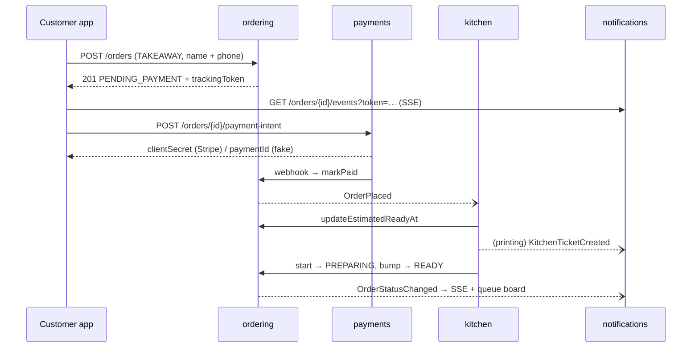

# Amadya Core API

Kotlin 2.3 · Spring Boot 4.1 · Spring Modulith 2.1 · Java 25 · PostgreSQL 17 · Flyway.
The REST contract is generated from [`../api/openapi/openapi.yaml`](../api/openapi/openapi.yaml) (ADR 0002).

## Run

```bash
# whole stack (from the repo root): Postgres + API + Caddy
docker compose up -d --build postgres api caddy

# or the API alone against the compose Postgres, with the demo menu
SPRING_PROFILES_ACTIVE=dev POSTGRES_PASSWORD=... DB_PORT=5432 ./gradlew bootRun
```

With the `dev` profile:
- the BurRegescu demo menu is loaded;
- `admin@amadya.local` is created on first start (the password comes from `AMADYA_ADMIN_PASSWORD`, or is generated and logged);
- CORS allows the local dev servers;
- the JWT secret may be generated (tokens then reset on restart).

## Test

```bash
./gradlew test   # needs Docker (Testcontainers)
```

- `ModularityTests` verifies module boundaries and writes module diagrams (PlantUML / C4) to `build/spring-modulith-docs`.
- `ApiIntegrationTests` drives the API over HTTP against a real Postgres. It covers:
  - the menu in RO/EN;
  - authentication: refresh-token rotation and reuse detection, role checks;
  - catalog administration;
  - the whole takeaway flow: order → payment → kitchen ticket → ready → queue board → pickup;
  - refund on cancel;
  - SSE.

## Modules

| Module | Public API (`ro.amadya.<module>`) | Notes |
|---|---|---|
| `settings` | `RestaurantSettingsApi` | profile, branding/theme, feature flags, VAT rates (21 / 11 / 0 %), stations |
| `identity` | — | users, JWT (HS256, 15 min) + rotating refresh tokens (30 days), bootstrap admin |
| `catalog` | `ProductCatalog.priceLines` | categories, products, modifier groups (min/max), localized menu |
| `ordering` | `OrderPlaced`, `OrderStatusChanged`, `OrderCancelled`, `OrderProgress`, `OrderPayments`, `OrderQueries` | guest checkout, daily numbers `B-001`, status machine, unpaid orders cancelled after 15 min |
| `kitchen` | `KitchenTicketCreated` | one ticket per station, ETA from prep time + station load, start / bump / recall |
| `payments` | — | `PaymentProvider` port: `fake` (dev, simulated capture) and `stripe` (PaymentIntents + webhook); refund on cancel |
| `notifications` | — | SSE: `/orders/{id}/events` (tracking token) and `/queue/events` |
| `printing` | — | `PRINTING_MODE=log`: kitchen tickets rendered to the log / `PRINTING_OUT_DIR` (hardware TBD, ADR 0003) |

Modules talk through events persisted in the Modulith event publication table (outbox). Listeners run after commit,
asynchronously, and are re-published on restart if they had not completed.

## Order flow



## Not in Phase 1 (by design)

- Tables / waiter sessions (Phase 4)
- STOMP live feed for staff apps (Phase 5)
- Print Bridge and fiscal receipts (Phase 6)
- Inventory, NIR and invoices (Phase 3)
- Push notifications (Phase 2)
- Image upload to MinIO (Phase 3)
