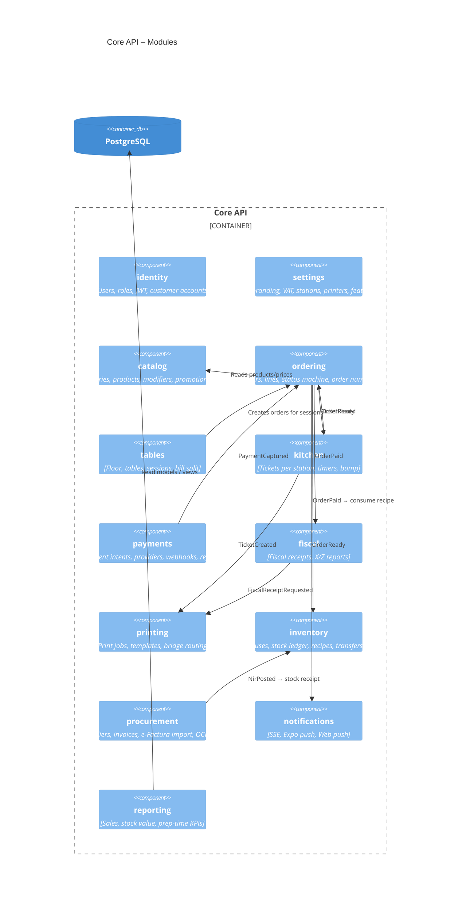

# C4 Level 3 — Core API components (Spring Modulith modules)

## Rules
- Each module is a top-level package `ro.amadya.<module>`. Other modules may only use its `api` sub-package
  (services, DTOs, events). Everything else is internal. `ApplicationModules.verify()` in tests enforces this.
- Modules talk to each other through **domain events**, persisted in the Spring Modulith event publication registry (transactional outbox).
  Synchronous calls are only for queries (e.g. ordering reads catalog prices).
- `shared` holds only primitives: Money, Quantity, LocalizedText, ids, and error types.
