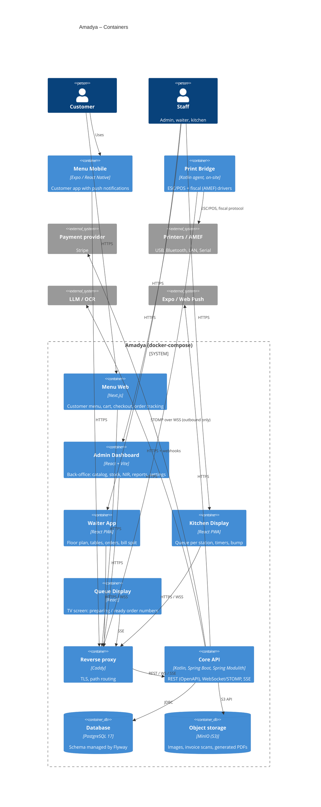

# C4 Level 2 — Containers

All frontends use the same generated TypeScript client built from `api/openapi`.
The Print Bridge only opens outbound connections, so the restaurant needs no inbound ports.
