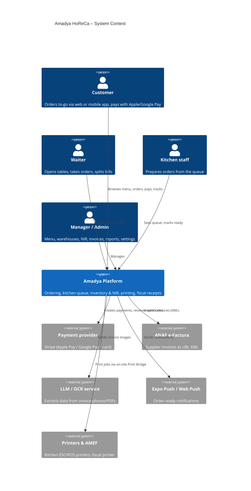

# C4 Level 1 — System Context

Notes
- Single-tenant per install: one restaurant (possibly with several stations/printers) per deployment.
- The Print Bridge sits on-site; the platform may run on-site or in the cloud.
