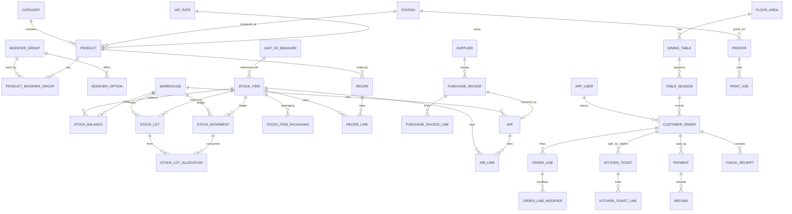

# Entity-relationship overview

Conventions:
- UUIDv7 primary keys.
- `created_at`, `updated_at`, `version` on every table.
- Money is `NUMERIC(12,2)`; quantities are `NUMERIC(14,3)`.
- Localized text is `jsonb` `{"ro": "...", "en": "..."}`.
- No cross-module foreign keys: other modules are referenced by id only.

Detailed columns are in the Flyway migrations (`backend/src/main/resources/db/migration`), which are the single source of truth.
