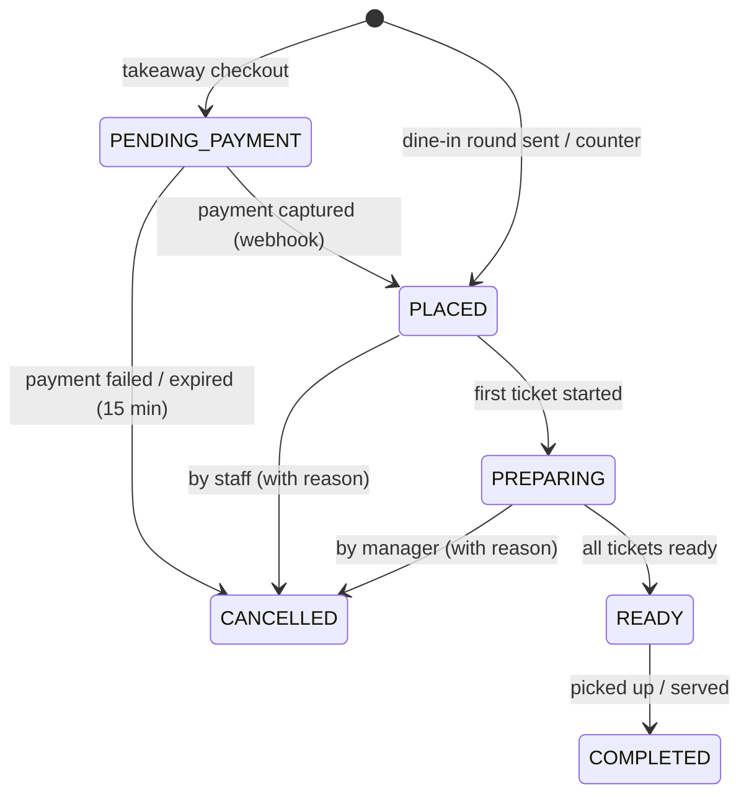

# Order lifecycle, kitchen queue & notifications

## Channels
- `TAKEAWAY`: customer orders from menu-web or menu-mobile and pays online (Apple/Google Pay).
- `DINE_IN`: waiter orders for a table session, in one or more rounds; the bill is paid at the end.
- `COUNTER`: a staff member enters a walk-in order (later, POS).

## Customer identity (takeaway)
- **Guest checkout is allowed.** Required: **name** and **phone** (E.164, validated; used to call the customer and as a fallback
  notification). Optional: email (for the receipt copy).
- Optional account: a customer may register (email + password or a phone OTP later) to see order history and save details.
  A guest order can be linked to an account later by matching the phone number after verification.
- Guests track their order with the `trackingToken` returned on creation (no login). Phone numbers are personal data:
  they are shown to staff only for active orders and anonymized after a retention period (GDPR; default 90 days, configurable).

## Status machine

## Kitchen tickets
- On `OrderPlaced`, lines are grouped by **station** (from `product.station_id`), giving one `kitchen_ticket` per station.
- Each ticket gets `estimated_ready_at = queued_at + max(prep_time_sec of its lines) + queue delay`, where the
  queue delay depends on the station's current load (configurable number of parallel slots per station).
- The kitchen & bar display (`apps/kitchen`) shows three columns per station:

  | Column | Ticket status | Colour |
  |---|---|---|
  | **În așteptare / Pending** | `QUEUED` | light yellow |
  | **În preparare / In preparation** | `IN_PROGRESS` | orange |
  | **Gata / Done** | `READY` | green |

  - Cooks and bartenders tap a card to start it and tap again to finish it. Undo (recall) stays available for 10 minutes.
  - A ticket past its estimate gets a red border and a "late" label.
  - Changes reach the displays live over `GET /kitchen/events?stationId=` (SSE).
- When a ticket is created, a print job is also sent to the station's printer, if one is configured.
- When **all** tickets of an order are READY, the order moves to READY.

## Customer notification
- The order tracking page subscribes over SSE to `/api/v1/orders/{id}/events` (authorized by a per-order tracking token).
- On READY:
  - SSE event;
  - Expo push (mobile) or Web Push (if the customer allowed it);
  - the queue display moves the order number to the "Ready" column.
- The pickup number is a daily sequence (e.g. `A-042`) shown on the order confirmation, the receipt and the queue screen.

## Payment & fiscal
- Takeaway: on payment captured → `OrderPaid` → a fiscal receipt job goes to the AMEF via the Print Bridge (payment type = card).
- Dine-in: the bill can be split by items or equally; each partial payment → one fiscal receipt.
- A fiscal receipt failure never blocks the kitchen. It is retried and shown to the cashier/admin.
